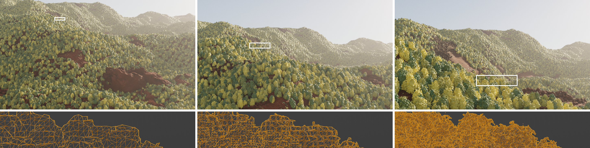

## BinocMesher: Temporally Smooth Mesh Extraction for Procedural Scenes with Long-Range Camera Trajectories using Spacetime Octrees
We propose a temporally coherent method for extracting meshes suitable for long-range camera trajectories in unbounded scenes represented by an occupancy function. The key idea is to perform 4D mesh extraction using a new spacetime tree structure called the binary-octree, from which 3D meshes are sliced.




If you use BinocMesher in your work, please cite our academic paper:

<h3 align="center">
    <a href="https://arxiv.org/pdf/2509.13306v2">
        Temporally Smooth Mesh Extraction for Procedural Scenes with Long-Range Camera Trajectories using Spacetime Octrees
    </a>
</h3>
<p align="center">
    <a href="https://mazeyu.github.io/">Zeyu Ma</a>, 
    <a href="https://www.cs.princeton.edu/~af">Adam Finkelstein</a>, 
    <a href="http://www.cs.princeton.edu/~jiadeng">Jia Deng</a><br>
</p>

```
@article{ma2025temporally,
  title={Temporally Smooth Mesh Extraction for Procedural Scenes with Long-Range Camera Trajectories using Spacetime Octrees},
  author={Ma, Zeyu and Finkelstein, Adam and Deng, Jia},
  booktitle={SIGGRAPH Asia 2025 Conference Papers},
  year={2025}
}
```

Arxiv paper: https://arxiv.org/pdf/2509.13306v2.

Please view the video here for an introduction and more results: https://www.youtube.com/watch?v=ziOa8Tr1iYc.


### Standalone Installation and Demo

**Note**: A display device is required to run the Pyrender demo. The resulting video will be saved at `results/demo.mp4`.

```bash
git clone https://github.com/princeton-vl/BinocMesher.git
cd BinocMesher/binocmesher
make
cd ..

conda create --name binocmesher python=3.10
conda activate binocmesher
pip install -r requirements.txt

python demo.py
```


### Use BinocMesher with Infinigen

Load the submodule `infinigen_binocmesher`, which is a fork of the [Infinigen Repository](https://github.com/princeton-vl/Infinigen) used during BinocMesher development, along with the necessary modifications.

```bash
git submodule update --init --recursive
```

#### Installation
Follow the standard Infinigen installation instruction:

```bash
cd infinigen_binocmesher
conda create --name infinigen python=3.10
conda activate infinigen
```

But due to a change in the `bpy` package, run:
```bash
pip install bpy==3.6.0 --extra-index-url https://download.blender.org/pypi/
```

Then link the binocmesher to the current Infinigen folder:

```bash
mkdir infinigen/BinocMesher
ln -s "$(realpath ../binocmesher)" infinigen/BinocMesher/binocmesher
```

Then run one of the install, e.g., the developer install:

```bash
pip install -e ".[dev,terrain,vis]"
pre-commit install
```

Finally, revert some changes of parameter names:
```bash
sed -i \
  -e 's/Subsurface Weight/Subsurface/g' \
  -e 's/Specular IOR Level/IOR/g' \
  -e 's/Coat Weight/Clearcoat/g' \
  -e 's/Coat Roughness/Clearcoat Roughness/g' \
  infinigen/infinigen_gpl/surfaces/snow.py
```


#### Example Scenes

Run the following command to generate the six example scenes in the paper:


Forest Scene:
```bash
python -m infinigen.datagen.manage_jobs --output_folder OUTPUT_FOLDER --num_scenes 1 --specific_seed 0 --configs mountain monocular simple no_assets --pipeline_configs cuda_terrain slurm monocular_video_hyperocmesher --pipeline_overrides ground_truth/queue_render.gpus=1 LocalScheduleHandler.use_gpu=True -p scene.upsidedown_mountains_chance=0 scene.sdf_trees_chance=1 nishita_lighting.sun_elevation=20 nishita_lighting.sun_rotation=0 shader_atmosphere.density=0.0005 shader_atmosphere.anisotropy=0.8 fine_terrain.mesher_backend="BinocMesher" "compose_nature.load_cameras=../infinigen_example_scenes/forest.txt" BinocMesher.pixels_per_cube=3 "execute_tasks.generate_resolution=(960,540)" full/configure_render_cycles.num_samples=8192
```

**Note**: If you are running on a local desktop instead of a SLURM cluster, replace `slurm` with the appropriate configuration. For a faster, exploratory run, you can reduce the resolution by changing `BinocMesher.pixels_per_cube=3` to `BinocMesher.pixels_per_cube=30`.


<details>
<summary>Click to expand</summary>

Mountain Scene:
```bash
python -m infinigen.datagen.manage_jobs --output_folder OUTPUT_FOLDER --num_scenes 1 --specific_seed 1 --configs snowy_mountain monocular high_quality_terrain no_assets --pipeline_configs cuda_terrain slurm monocular_video_hyperocmesher --pipeline_overrides ground_truth/queue_render.gpus=1 LocalScheduleHandler.use_gpu=True -p LandTiles.assets_seed_override=64090700628785987370221272729015798609 fine_terrain.mesher_backend="BinocMesher" compose_nature.load_cameras=../infinigen_example_scenes/snowy_mountain.txt BinocMesher.pixels_per_cube=3 "execute_tasks.generate_resolution=(960,540)" full/configure_render_cycles.num_samples=8192
```

Arctic Scene:
```bash
python -m infinigen.datagen.manage_jobs --output_folder OUTPUT_FOLDER --num_scenes 1 --specific_seed 0 --configs arctic  monocular high_quality_terrain no_assets --pipeline_configs cuda_terrain slurm monocular_video_hyperocmesher --pipeline_overrides ground_truth/queue_render.gpus=1 LocalScheduleHandler.use_gpu=True -p scene.caves_chance=0 scene.voronoi_rocks_chance=1 nishita_lighting.sun_elevation=5   fine_terrain.mesher_backend="BinocMesher" "compose_nature.load_cameras=../infinigen_example_scenes/arctic.txt" BinocMesher.pixels_per_cube=3 "execute_tasks.generate_resolution=(960,540)" full/configure_render_cycles.num_samples=8192
```

Cave Scene:
```bash
python -m infinigen.datagen.manage_jobs --output_folder OUTPUT_FOLDER --num_scenes 1 --specific_seed 1 --configs cave monocular high_quality_terrain no_assets  --pipeline_configs cuda_terrain slurm monocular_video_hyperocmesher  --pipeline_override ground_truth/queue_render.gpus=1s LocalScheduleHandler.use_gpu=True -p caves.load_assets.on_the_fly_instances=1  landtiles.load_assets.on_the_fly_instances=1 "Terrain.populated_bounds=(-25, 25, -25, 25, -25, 10)" Caves.height_offset=-3 Waterbody.height=-3 scene.waterbody_chance=1 scene.voronoi_rocks_chance=1 scene.warped_rocks_chance=0 "surface.registry.ground_collection=[('mountain', 1)]" "surface.registry.mountain_collection=[('mountain', 1)]" BinocMesher.relax_iters=6 nishita_lighting.sun_elevation=90 mountain.shader.random_seed=2 compose_nature.camera_lighting=True fine_terrain.mesher_backend="BinocMesher" "compose_nature.load_cameras=../infinigen_example_scenes/cave.txt" BinocMesher.pixels_per_cube=3 "execute_tasks.generate_resolution=(960,540)" full/configure_render_cycles.num_samples=8192
```


Beach Scene:
```bash
python -m infinigen.datagen.manage_jobs --output_folder OUTPUT_FOLDER --num_scenes 1 --specific_seed 3e1fa8c6 --config coast monocular high_quality_terrain trailer_video no_assets  --pipeline_configs slurm cuda_terrain monocular_video_hyperocmesher --pipeline_overrides ground_truth/queue_render.gpus=1 LocalScheduleHandler.use_gpu=True -p scene.voronoi_rocks_chance=1 scene.volcanos_chance=0 compose_nature.fancy_clouds_chance=1 compose_nature.ground_creatures_chance=1 "compose_nature.ground_creature_registry=[(@CrabFactory, 1)]" water.is_ocean=1 compose_nature.pose_cameras_seed_offset=2333 compose_nature.crab_seed_offset=1 "AnimPolicyRandomWalkLookaround.rot_vars=(30, 0, 0)" AnimPolicyRandomWalkLookaround.speed=3 "AnimPolicyRandomWalkLookaround.step_range=(40,41)" compose_nature.animate_cameras_seed_offset=8 walk_same_altitude.step_up_height=9 walk_same_altitude.fall_ratio=-1.5 nishita_lighting.air_density=0.2 kole_clouds_shader.translation=-1 kole_clouds_shader.coverage_frame_start=-0.3 kole_clouds_shader.coverage_frame_end=-0.3 compose_nature.fancy_clouds_seed_offset=2333 scene.voronoi_grains_chance=0 "compose_nature.manual_terrain_center=((65.625, -67.188, 0.142), 3.1112698372)" fine_terrain.mesher_backend="BinocMesher" compose_nature.load_cameras=../infinigen_example_scenes/beach.txt BinocMesher.pixels_per_cube=3 "execute_tasks.generate_resolution=(960,540)" full/configure_render_cycles.num_samples=8192
```

City Scene:
```bash
python -m infinigen.datagen.manage_jobs --output_folder OUTPUT_FOLDER --num_scenes 1 --specific_seed 0 --configs plain monocular simple no_assets --pipeline_configs cuda_terrain slurm monocular_video_hyperocmesher --pipeline_overrides ground_truth/queue_render.gpus=1 LocalScheduleHandler.use_gpu=True -p scene.upsidedown_mountains_chance=0 scene.sdf_city_chance=1 shader_atmosphere.anisotropy=0.8 shader_atmosphere.density=0.002 shader_stone.instance_color=1 "surface.registry.ground_collection=[('stone', 1)]" "surface.registry.mountain_collection=[('stone', 1)]" scene.voronoi_rocks_chance=0 nishita_lighting.sun_rotation=270 nishita_lighting.dynamic=1 shader_atmosphere.dynamic=1 Terrain.simplify_occluded_individual_transparent=True fine_terrain.mesher_backend="BinocMesher" compose_nature.load_cameras=../infinigen_example_scenes/city.txt BinocMesher.pixels_per_cube=3 Terrain.pixels_per_cube_individual_transparent=6 "execute_tasks.generate_resolution=(960,540)" full/configure_render_cycles.num_samples=8192
```

</details>


### Using BinocMesher with the Latest Infinigen

*Details coming soon.*
